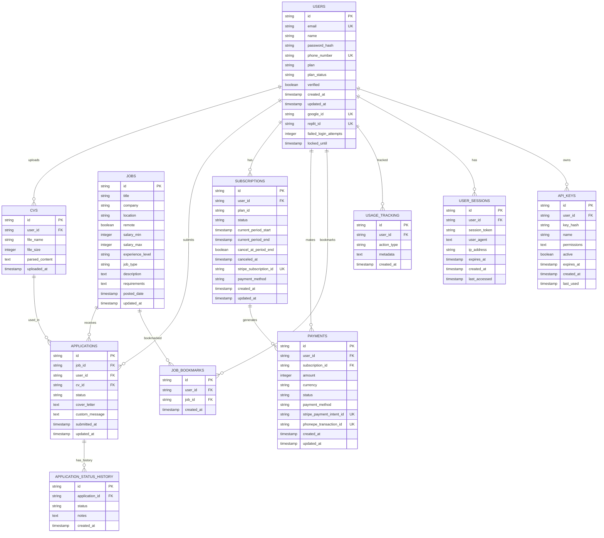

# Jobr Platform Database Schema Documentation

## Overview

The Jobr platform uses PostgreSQL as its primary database with Drizzle ORM for type-safe database operations. The schema is designed for high performance with proper indexing, relationships, and scalability considerations.

**Database**: PostgreSQL 14+  
**ORM**: Drizzle ORM with TypeScript  
**Migration Tool**: Drizzle Kit  
**Performance**: Optimized with strategic indexing  
**Backup**: Automated daily backups with point-in-time recovery

---

## Table of Contents

1. [Entity Relationship Diagram](#entity-relationship-diagram)
2. [Core Tables](#core-tables)
3. [Table Relationships](#table-relationships)
4. [Indexing Strategy](#indexing-strategy)
5. [Data Types and Constraints](#data-types-and-constraints)
6. [Migration Guidelines](#migration-guidelines)
7. [Performance Considerations](#performance-considerations)
8. [Data Retention Policies](#data-retention-policies)

---

## Entity Relationship Diagram



---

## Core Tables

### 1. Users Table

**Primary entity for all platform users**

```sql
CREATE TABLE users (
    id UUID PRIMARY KEY DEFAULT gen_random_uuid(),
    email VARCHAR(255) UNIQUE,
    name VARCHAR(255) NOT NULL,
    password_hash VARCHAR(255),
    phone_number VARCHAR(20) UNIQUE,
    plan VARCHAR(50) NOT NULL DEFAULT 'Free',
    plan_status VARCHAR(20) NOT NULL DEFAULT 'active',
    verified BOOLEAN DEFAULT FALSE,
    created_at TIMESTAMP WITH TIME ZONE DEFAULT NOW(),
    updated_at TIMESTAMP WITH TIME ZONE DEFAULT NOW(),
    
    -- OAuth integration fields
    google_id VARCHAR(255) UNIQUE,
    replit_id VARCHAR(255) UNIQUE,
    
    -- Security fields
    failed_login_attempts INTEGER DEFAULT 0,
    locked_until TIMESTAMP WITH TIME ZONE,
    
    -- Constraints
    CONSTRAINT users_email_or_phone_required 
        CHECK (email IS NOT NULL OR phone_number IS NOT NULL),
    CONSTRAINT users_plan_valid 
        CHECK (plan IN ('Free', 'Premium', 'Enterprise')),
    CONSTRAINT users_plan_status_valid 
        CHECK (plan_status IN ('active', 'cancelled', 'past_due', 'unpaid'))
);
```

**Drizzle Schema:**
```typescript
export const users = pgTable('users', {
  id: uuid('id').defaultRandom().primaryKey(),
  email: varchar('email', { length: 255 }).unique(),
  name: varchar('name', { length: 255 }).notNull(),
  passwordHash: varchar('password_hash', { length: 255 }),
  phoneNumber: varchar('phone_number', { length: 20 }).unique(),
  plan: varchar('plan', { length: 50 }).notNull().default('Free'),
  planStatus: varchar('plan_status', { length: 20 }).notNull().default('active'),
  verified: boolean('verified').default(false),
  createdAt: timestamp('created_at').defaultNow(),
  updatedAt: timestamp('updated_at').defaultNow(),
  googleId: varchar('google_id', { length: 255 }).unique(),
  replitId: varchar('replit_id', { length: 255 }).unique(),
  failedLoginAttempts: integer('failed_login_attempts').default(0),
  lockedUntil: timestamp('locked_until')
});
```

**Indexes:**
```sql
CREATE INDEX idx_users_email ON users(email) WHERE email IS NOT NULL;
CREATE INDEX idx_users_phone ON users(phone_number) WHERE phone_number IS NOT NULL;  
CREATE INDEX idx_users_plan_status ON users(plan, plan_status);
CREATE INDEX idx_users_google_id ON users(google_id) WHERE google_id IS NOT NULL;
CREATE INDEX idx_users_replit_id ON users(replit_id) WHERE replit_id IS NOT NULL;
CREATE INDEX idx_users_created_at ON users(created_at);
```

### 2. CVs Table

**Stores uploaded CV files and extracted content**

```sql
CREATE TABLE cvs (
    id UUID PRIMARY KEY DEFAULT gen_random_uuid(),
    user_id UUID NOT NULL REFERENCES users(id) ON DELETE CASCADE,
    file_name VARCHAR(255) NOT NULL,
    file_size INTEGER NOT NULL,
    parsed_content TEXT NOT NULL,
    uploaded_at TIMESTAMP WITH TIME ZONE DEFAULT NOW(),
    
    -- Constraints
    CONSTRAINT cvs_file_size_limit CHECK (file_size <= 5242880), -- 5MB
    CONSTRAINT cvs_file_name_length CHECK (LENGTH(file_name) > 0)
);
```

**Drizzle Schema:**
```typescript
export const cvs = pgTable('cvs', {
  id: uuid('id').defaultRandom().primaryKey(),
  userId: uuid('user_id').notNull().references(() => users.id, { onDelete: 'cascade' }),
  fileName: varchar('file_name', { length: 255 }).notNull(),
  fileSize: integer('file_size').notNull(),
  parsedContent: text('parsed_content').notNull(),
  uploadedAt: timestamp('uploaded_at').defaultNow()
});
```

**Indexes:**
```sql
CREATE INDEX idx_cvs_user_id ON cvs(user_id);
CREATE INDEX idx_cvs_uploaded_at ON cvs(uploaded_at DESC);
CREATE INDEX idx_cvs_parsed_content_fts ON cvs USING gin(to_tsvector('english', parsed_content));
```

### 3. Jobs Table

**Stores job postings and requirements**

```sql
CREATE TABLE jobs (
    id UUID PRIMARY KEY DEFAULT gen_random_uuid(),
    title VARCHAR(255) NOT NULL,
    company VARCHAR(255) NOT NULL,
    location VARCHAR(255),
    remote BOOLEAN DEFAULT FALSE,
    salary_min INTEGER,
    salary_max INTEGER,
    experience_level VARCHAR(20),
    job_type VARCHAR(20) NOT NULL DEFAULT 'full-time',
    description TEXT NOT NULL,
    requirements TEXT[] DEFAULT '{}',
    posted_date TIMESTAMP WITH TIME ZONE DEFAULT NOW(),
    updated_at TIMESTAMP WITH TIME ZONE DEFAULT NOW(),
    
    -- Constraints
    CONSTRAINT jobs_salary_valid CHECK (salary_max >= salary_min),
    CONSTRAINT jobs_experience_level_valid 
        CHECK (experience_level IN ('junior', 'mid', 'senior', 'executive')),
    CONSTRAINT jobs_job_type_valid 
        CHECK (job_type IN ('full-time', 'part-time', 'contract', 'internship', 'freelance'))
);
```

**Drizzle Schema:**
```typescript
export const jobs = pgTable('jobs', {
  id: uuid('id').defaultRandom().primaryKey(),
  title: varchar('title', { length: 255 }).notNull(),
  company: varchar('company', { length: 255 }).notNull(),
  location: varchar('location', { length: 255 }),
  remote: boolean('remote').default(false),
  salaryMin: integer('salary_min'),
  salaryMax: integer('salary_max'),
  experienceLevel: varchar('experience_level', { length: 20 }),
  jobType: varchar('job_type', { length: 20 }).notNull().default('full-time'),
  description: text('description').notNull(),
  requirements: text('requirements').array().default([]),
  postedDate: timestamp('posted_date').defaultNow(),
  updatedAt: timestamp('updated_at').defaultNow()
});
```

**Indexes:**
```sql
CREATE INDEX idx_jobs_title_company ON jobs(title, company);
CREATE INDEX idx_jobs_location ON jobs(location) WHERE location IS NOT NULL;
CREATE INDEX idx_jobs_remote ON jobs(remote) WHERE remote = TRUE;
CREATE INDEX idx_jobs_salary ON jobs(salary_min, salary_max);
CREATE INDEX idx_jobs_experience_level ON jobs(experience_level);
CREATE INDEX idx_jobs_job_type ON jobs(job_type);
CREATE INDEX idx_jobs_posted_date ON jobs(posted_date DESC);
CREATE INDEX idx_jobs_search_fts ON jobs USING gin(
    to_tsvector('english', title || ' ' || company || ' ' || COALESCE(description, ''))
);
```

### 4. Applications Table

**Tracks job applications submitted by users**

```sql
CREATE TABLE applications (
    id UUID PRIMARY KEY DEFAULT gen_random_uuid(),
    job_id UUID NOT NULL REFERENCES jobs(id) ON DELETE CASCADE,
    user_id UUID NOT NULL REFERENCES users(id) ON DELETE CASCADE,
    cv_id UUID NOT NULL REFERENCES cvs(id) ON DELETE CASCADE,
    status VARCHAR(20) NOT NULL DEFAULT 'submitted',
    cover_letter TEXT,
    custom_message TEXT,
    submitted_at TIMESTAMP WITH TIME ZONE DEFAULT NOW(),
    updated_at TIMESTAMP WITH TIME ZONE DEFAULT NOW(),
    
    -- Unique constraint to prevent duplicate applications
    UNIQUE(job_id, user_id),
    
    -- Constraints
    CONSTRAINT applications_status_valid 
        CHECK (status IN ('submitted', 'reviewing', 'interview', 'rejected', 'accepted', 'withdrawn'))
);
```

**Drizzle Schema:**
```typescript
export const applications = pgTable('applications', {
  id: uuid('id').defaultRandom().primaryKey(),
  jobId: uuid('job_id').notNull().references(() => jobs.id, { onDelete: 'cascade' }),
  userId: uuid('user_id').notNull().references(() => users.id, { onDelete: 'cascade' }),
  cvId: uuid('cv_id').notNull().references(() => cvs.id, { onDelete: 'cascade' }),
  status: varchar('status', { length: 20 }).notNull().default('submitted'),
  coverLetter: text('cover_letter'),
  customMessage: text('custom_message'),
  submittedAt: timestamp('submitted_at').defaultNow(),
  updatedAt: timestamp('updated_at').defaultNow()
}, (table) => ({
  uniqueJobUser: unique().on(table.jobId, table.userId)
}));
```

**Indexes:**
```sql
CREATE INDEX idx_applications_user_id ON applications(user_id);
CREATE INDEX idx_applications_job_id ON applications(job_id);
CREATE INDEX idx_applications_cv_id ON applications(cv_id);
CREATE INDEX idx_applications_status ON applications(status);
CREATE INDEX idx_applications_user_status ON applications(user_id, status);
CREATE INDEX idx_applications_submitted_at ON applications(submitted_at DESC);
```

### 5. Subscriptions Table

**Manages user subscription data**

```sql
CREATE TABLE subscriptions (
    id UUID PRIMARY KEY DEFAULT gen_random_uuid(),
    user_id UUID NOT NULL REFERENCES users(id) ON DELETE CASCADE,
    plan_id VARCHAR(50) NOT NULL,
    status VARCHAR(20) NOT NULL DEFAULT 'active',
    current_period_start TIMESTAMP WITH TIME ZONE NOT NULL,
    current_period_end TIMESTAMP WITH TIME ZONE NOT NULL,
    cancel_at_period_end BOOLEAN DEFAULT FALSE,
    canceled_at TIMESTAMP WITH TIME ZONE,
    stripe_subscription_id VARCHAR(255) UNIQUE,
    payment_method VARCHAR(20) NOT NULL DEFAULT 'stripe',
    created_at TIMESTAMP WITH TIME ZONE DEFAULT NOW(),
    updated_at TIMESTAMP WITH TIME ZONE DEFAULT NOW(),
    
    -- Constraints
    CONSTRAINT subscriptions_status_valid 
        CHECK (status IN ('active', 'canceled', 'past_due', 'unpaid', 'paused')),
    CONSTRAINT subscriptions_payment_method_valid 
        CHECK (payment_method IN ('stripe', 'phonepe')),
    CONSTRAINT subscriptions_period_valid 
        CHECK (current_period_end > current_period_start)
);
```

**Drizzle Schema:**
```typescript
export const subscriptions = pgTable('subscriptions', {
  id: uuid('id').defaultRandom().primaryKey(),
  userId: uuid('user_id').notNull().references(() => users.id, { onDelete: 'cascade' }),
  planId: varchar('plan_id', { length: 50 }).notNull(),
  status: varchar('status', { length: 20 }).notNull().default('active'),
  currentPeriodStart: timestamp('current_period_start').notNull(),
  currentPeriodEnd: timestamp('current_period_end').notNull(),
  cancelAtPeriodEnd: boolean('cancel_at_period_end').default(false),
  canceledAt: timestamp('canceled_at'),
  stripeSubscriptionId: varchar('stripe_subscription_id', { length: 255 }).unique(),
  paymentMethod: varchar('payment_method', { length: 20 }).notNull().default('stripe'),
  createdAt: timestamp('created_at').defaultNow(),
  updatedAt: timestamp('updated_at').defaultNow()
});
```

**Indexes:**
```sql
CREATE INDEX idx_subscriptions_user_id ON subscriptions(user_id);
CREATE INDEX idx_subscriptions_status ON subscriptions(status);
CREATE INDEX idx_subscriptions_user_status ON subscriptions(user_id, status);
CREATE INDEX idx_subscriptions_period_end ON subscriptions(current_period_end);
CREATE INDEX idx_subscriptions_stripe_id ON subscriptions(stripe_subscription_id) 
    WHERE stripe_subscription_id IS NOT NULL;
```

### 6. Payments Table

**Tracks all payment transactions**

```sql
CREATE TABLE payments (
    id UUID PRIMARY KEY DEFAULT gen_random_uuid(),
    user_id UUID NOT NULL REFERENCES users(id) ON DELETE CASCADE,
    subscription_id UUID REFERENCES subscriptions(id) ON DELETE SET NULL,
    amount INTEGER NOT NULL,
    currency VARCHAR(3) NOT NULL DEFAULT 'USD',
    status VARCHAR(20) NOT NULL DEFAULT 'pending',
    payment_method VARCHAR(20) NOT NULL,
    stripe_payment_intent_id VARCHAR(255) UNIQUE,
    phonepe_transaction_id VARCHAR(255) UNIQUE,
    created_at TIMESTAMP WITH TIME ZONE DEFAULT NOW(),
    updated_at TIMESTAMP WITH TIME ZONE DEFAULT NOW(),
    
    -- Constraints
    CONSTRAINT payments_amount_positive CHECK (amount > 0),
    CONSTRAINT payments_currency_valid CHECK (currency IN ('USD', 'INR', 'EUR', 'GBP')),
    CONSTRAINT payments_status_valid 
        CHECK (status IN ('pending', 'processing', 'succeeded', 'failed', 'canceled')),
    CONSTRAINT payments_method_valid 
        CHECK (payment_method IN ('stripe', 'phonepe'))
);
```

**Drizzle Schema:**
```typescript
export const payments = pgTable('payments', {
  id: uuid('id').defaultRandom().primaryKey(),
  userId: uuid('user_id').notNull().references(() => users.id, { onDelete: 'cascade' }),
  subscriptionId: uuid('subscription_id').references(() => subscriptions.id, { onDelete: 'set null' }),
  amount: integer('amount').notNull(),
  currency: varchar('currency', { length: 3 }).notNull().default('USD'),
  status: varchar('status', { length: 20 }).notNull().default('pending'),
  paymentMethod: varchar('payment_method', { length: 20 }).notNull(),
  stripePaymentIntentId: varchar('stripe_payment_intent_id', { length: 255 }).unique(),
  phonepeTransactionId: varchar('phonepe_transaction_id', { length: 255 }).unique(),
  createdAt: timestamp('created_at').defaultNow(),
  updatedAt: timestamp('updated_at').defaultNow()
});
```

**Indexes:**
```sql
CREATE INDEX idx_payments_user_id ON payments(user_id);
CREATE INDEX idx_payments_subscription_id ON payments(subscription_id);
CREATE INDEX idx_payments_status ON payments(status);
CREATE INDEX idx_payments_method ON payments(payment_method);
CREATE INDEX idx_payments_created_at ON payments(created_at DESC);
CREATE INDEX idx_payments_stripe_intent ON payments(stripe_payment_intent_id) 
    WHERE stripe_payment_intent_id IS NOT NULL;
CREATE INDEX idx_payments_phonepe_txn ON payments(phonepe_transaction_id) 
    WHERE phonepe_transaction_id IS NOT NULL;
```

### 7. Job Bookmarks Table

**Tracks jobs bookmarked by users**

```sql
CREATE TABLE job_bookmarks (
    id UUID PRIMARY KEY DEFAULT gen_random_uuid(),
    user_id UUID NOT NULL REFERENCES users(id) ON DELETE CASCADE,
    job_id UUID NOT NULL REFERENCES jobs(id) ON DELETE CASCADE,
    created_at TIMESTAMP WITH TIME ZONE DEFAULT NOW(),
    
    -- Unique constraint to prevent duplicate bookmarks
    UNIQUE(user_id, job_id)
);
```

**Drizzle Schema:**
```typescript
export const jobBookmarks = pgTable('job_bookmarks', {
  id: uuid('id').defaultRandom().primaryKey(),
  userId: uuid('user_id').notNull().references(() => users.id, { onDelete: 'cascade' }),
  jobId: uuid('job_id').notNull().references(() => jobs.id, { onDelete: 'cascade' }),
  createdAt: timestamp('created_at').defaultNow()
}, (table) => ({
  uniqueUserJob: unique().on(table.userId, table.jobId)
}));
```

**Indexes:**
```sql
CREATE INDEX idx_job_bookmarks_user_id ON job_bookmarks(user_id);
CREATE INDEX idx_job_bookmarks_job_id ON job_bookmarks(job_id);
CREATE INDEX idx_job_bookmarks_created_at ON job_bookmarks(created_at DESC);
```

### 8. Application Status History Table

**Tracks application status changes over time**

```sql
CREATE TABLE application_status_history (
    id UUID PRIMARY KEY DEFAULT gen_random_uuid(),
    application_id UUID NOT NULL REFERENCES applications(id) ON DELETE CASCADE,
    status VARCHAR(20) NOT NULL,
    notes TEXT,
    created_at TIMESTAMP WITH TIME ZONE DEFAULT NOW(),
    
    -- Constraints
    CONSTRAINT ash_status_valid 
        CHECK (status IN ('submitted', 'reviewing', 'interview', 'rejected', 'accepted', 'withdrawn'))
);
```

**Drizzle Schema:**
```typescript
export const applicationStatusHistory = pgTable('application_status_history', {
  id: uuid('id').defaultRandom().primaryKey(),
  applicationId: uuid('application_id').notNull().references(() => applications.id, { onDelete: 'cascade' }),
  status: varchar('status', { length: 20 }).notNull(),
  notes: text('notes'),
  createdAt: timestamp('created_at').defaultNow()
});
```

**Indexes:**
```sql
CREATE INDEX idx_ash_application_id ON application_status_history(application_id);
CREATE INDEX idx_ash_created_at ON application_status_history(created_at DESC);
CREATE INDEX idx_ash_app_created ON application_status_history(application_id, created_at DESC);
```

### 9. Usage Tracking Table

**Tracks user actions for analytics and billing**

```sql
CREATE TABLE usage_tracking (
    id UUID PRIMARY KEY DEFAULT gen_random_uuid(),
    user_id UUID NOT NULL REFERENCES users(id) ON DELETE CASCADE,
    action_type VARCHAR(50) NOT NULL,
    metadata JSONB DEFAULT '{}',
    created_at TIMESTAMP WITH TIME ZONE DEFAULT NOW(),
    
    -- Constraints
    CONSTRAINT ut_action_type_valid 
        CHECK (action_type IN ('cv_upload', 'job_application', 'ai_match', 'cover_letter_generated'))
);
```

**Drizzle Schema:**
```typescript
export const usageTracking = pgTable('usage_tracking', {
  id: uuid('id').defaultRandom().primaryKey(),
  userId: uuid('user_id').notNull().references(() => users.id, { onDelete: 'cascade' }),
  actionType: varchar('action_type', { length: 50 }).notNull(),
  metadata: jsonb('metadata').default({}),
  createdAt: timestamp('created_at').defaultNow()
});
```

**Indexes:**
```sql
CREATE INDEX idx_ut_user_id ON usage_tracking(user_id);
CREATE INDEX idx_ut_action_type ON usage_tracking(action_type);
CREATE INDEX idx_ut_created_at ON usage_tracking(created_at DESC);
CREATE INDEX idx_ut_user_action_date ON usage_tracking(user_id, action_type, created_at DESC);
CREATE INDEX idx_ut_metadata ON usage_tracking USING gin(metadata);
```

### 10. User Sessions Table

**Manages active user sessions**

```sql
CREATE TABLE user_sessions (
    id UUID PRIMARY KEY DEFAULT gen_random_uuid(),
    user_id UUID NOT NULL REFERENCES users(id) ON DELETE CASCADE,
    session_token VARCHAR(500) NOT NULL UNIQUE,
    user_agent TEXT,
    ip_address INET,
    expires_at TIMESTAMP WITH TIME ZONE NOT NULL,
    created_at TIMESTAMP WITH TIME ZONE DEFAULT NOW(),
    last_accessed TIMESTAMP WITH TIME ZONE DEFAULT NOW(),
    
    -- Constraints
    CONSTRAINT us_expires_future CHECK (expires_at > created_at)
);
```

**Drizzle Schema:**
```typescript
export const userSessions = pgTable('user_sessions', {
  id: uuid('id').defaultRandom().primaryKey(),
  userId: uuid('user_id').notNull().references(() => users.id, { onDelete: 'cascade' }),
  sessionToken: varchar('session_token', { length: 500 }).notNull().unique(),
  userAgent: text('user_agent'),
  ipAddress: varchar('ip_address', { length: 45 }),
  expiresAt: timestamp('expires_at').notNull(),
  createdAt: timestamp('created_at').defaultNow(),
  lastAccessed: timestamp('last_accessed').defaultNow()
});
```

**Indexes:**
```sql
CREATE INDEX idx_us_user_id ON user_sessions(user_id);
CREATE INDEX idx_us_session_token ON user_sessions(session_token);
CREATE INDEX idx_us_expires_at ON user_sessions(expires_at);
CREATE INDEX idx_us_last_accessed ON user_sessions(last_accessed DESC);
```

### 11. API Keys Table

**Manages API keys for programmatic access**

```sql
CREATE TABLE api_keys (
    id UUID PRIMARY KEY DEFAULT gen_random_uuid(),
    user_id UUID NOT NULL REFERENCES users(id) ON DELETE CASCADE,
    key_hash VARCHAR(255) NOT NULL UNIQUE,
    name VARCHAR(100) NOT NULL,
    permissions TEXT[] DEFAULT '{}',
    active BOOLEAN DEFAULT TRUE,
    expires_at TIMESTAMP WITH TIME ZONE,
    created_at TIMESTAMP WITH TIME ZONE DEFAULT NOW(),
    last_used TIMESTAMP WITH TIME ZONE,
    
    -- Constraints
    CONSTRAINT ak_name_length CHECK (LENGTH(name) > 0)
);
```

**Drizzle Schema:**
```typescript
export const apiKeys = pgTable('api_keys', {
  id: uuid('id').defaultRandom().primaryKey(),
  userId: uuid('user_id').notNull().references(() => users.id, { onDelete: 'cascade' }),
  keyHash: varchar('key_hash', { length: 255 }).notNull().unique(),
  name: varchar('name', { length: 100 }).notNull(),
  permissions: text('permissions').array().default([]),
  active: boolean('active').default(true),
  expiresAt: timestamp('expires_at'),
  createdAt: timestamp('created_at').defaultNow(),
  lastUsed: timestamp('last_used')
});
```

**Indexes:**
```sql
CREATE INDEX idx_ak_user_id ON api_keys(user_id);
CREATE INDEX idx_ak_key_hash ON api_keys(key_hash);
CREATE INDEX idx_ak_active ON api_keys(active) WHERE active = TRUE;
CREATE INDEX idx_ak_expires_at ON api_keys(expires_at) WHERE expires_at IS NOT NULL;
```

---

## Table Relationships

### 1. Primary Relationships

**User-Centric Design:**
- **Users → CVs**: One-to-many (users can upload multiple CVs)
- **Users → Applications**: One-to-many (users can apply to multiple jobs)
- **Users → Subscriptions**: One-to-many (users can have subscription history)
- **Users → Payments**: One-to-many (users make multiple payments)
- **Users → Job Bookmarks**: One-to-many (users can bookmark multiple jobs)

**Job-Centric Relationships:**
- **Jobs → Applications**: One-to-many (jobs receive multiple applications)
- **Jobs → Job Bookmarks**: One-to-many (jobs can be bookmarked by multiple users)

**Application Workflow:**
- **Applications → Application Status History**: One-to-many (status changes over time)
- **CVs → Applications**: One-to-many (CVs can be used in multiple applications)

**Payment & Subscription Flow:**
- **Subscriptions → Payments**: One-to-many (subscriptions generate multiple payments)

### 2. Foreign Key Constraints

```sql
-- Cascade deletes for data integrity
ALTER TABLE cvs ADD CONSTRAINT fk_cvs_user_id 
    FOREIGN KEY (user_id) REFERENCES users(id) ON DELETE CASCADE;

ALTER TABLE applications ADD CONSTRAINT fk_applications_user_id 
    FOREIGN KEY (user_id) REFERENCES users(id) ON DELETE CASCADE;

ALTER TABLE applications ADD CONSTRAINT fk_applications_job_id 
    FOREIGN KEY (job_id) REFERENCES jobs(id) ON DELETE CASCADE;

ALTER TABLE applications ADD CONSTRAINT fk_applications_cv_id 
    FOREIGN KEY (cv_id) REFERENCES cvs(id) ON DELETE CASCADE;

-- Set null for optional relationships
ALTER TABLE payments ADD CONSTRAINT fk_payments_subscription_id 
    FOREIGN KEY (subscription_id) REFERENCES subscriptions(id) ON DELETE SET NULL;
```

### 3. Referential Integrity Rules

**Deletion Policies:**
- **CASCADE**: When user is deleted, all related data is removed (CVs, applications, sessions)
- **SET NULL**: When optional parent is deleted, child records remain with null reference
- **RESTRICT**: Prevent deletion if child records exist (not used in current schema)

---

## Indexing Strategy

### 1. Primary Access Patterns

**User Authentication:**
```sql
-- Fast email/phone lookup for login
CREATE INDEX idx_users_email ON users(email) WHERE email IS NOT NULL;
CREATE INDEX idx_users_phone ON users(phone_number) WHERE phone_number IS NOT NULL;
```

**Job Search:**
```sql
-- Full-text search on jobs
CREATE INDEX idx_jobs_search_fts ON jobs USING gin(
    to_tsvector('english', title || ' ' || company || ' ' || COALESCE(description, ''))
);

-- Job filtering
CREATE INDEX idx_jobs_location_remote ON jobs(location, remote);
CREATE INDEX idx_jobs_salary_range ON jobs(salary_min, salary_max) WHERE salary_min IS NOT NULL;
```

**Application Management:**
```sql
-- User's applications by status
CREATE INDEX idx_applications_user_status ON applications(user_id, status);

-- Job application counts
CREATE INDEX idx_applications_job_submitted ON applications(job_id) 
    WHERE status != 'withdrawn';
```

### 2. Performance Indexes

**Time-Series Queries:**
```sql
-- Recent data access
CREATE INDEX idx_applications_submitted_at ON applications(submitted_at DESC);
CREATE INDEX idx_payments_created_at ON payments(created_at DESC);
CREATE INDEX idx_usage_tracking_created_at ON usage_tracking(created_at DESC);
```

**Composite Indexes:**
```sql
-- Multi-column queries
CREATE INDEX idx_subscriptions_user_active ON subscriptions(user_id, status) 
    WHERE status = 'active';

CREATE INDEX idx_cvs_user_recent ON cvs(user_id, uploaded_at DESC);
```

### 3. Partial Indexes

**Condition-Specific Performance:**
```sql
-- Only index active records
CREATE INDEX idx_api_keys_active ON api_keys(active) WHERE active = TRUE;

-- Only index non-null values
CREATE INDEX idx_jobs_remote_only ON jobs(remote) WHERE remote = TRUE;

-- Only index valid sessions
CREATE INDEX idx_sessions_valid ON user_sessions(expires_at) 
    WHERE expires_at > NOW();
```

---

## Data Types and Constraints

### 1. UUID Strategy

**Primary Keys:**
- All tables use UUID v4 for primary keys
- Provides global uniqueness and security
- Better for distributed systems and microservices
- Prevents enumeration attacks

```sql
-- UUID generation
CREATE EXTENSION IF NOT EXISTS "uuid-ossp";
-- Or for PostgreSQL 13+
CREATE EXTENSION IF NOT EXISTS "pgcrypto";

-- Usage in tables
id UUID PRIMARY KEY DEFAULT gen_random_uuid()
```

### 2. Timestamp Handling

**Consistent Time Zones:**
```sql
-- All timestamps with timezone
created_at TIMESTAMP WITH TIME ZONE DEFAULT NOW(),
updated_at TIMESTAMP WITH TIME ZONE DEFAULT NOW()

-- Automatic update trigger
CREATE OR REPLACE FUNCTION update_updated_at()
RETURNS TRIGGER AS $$
BEGIN
    NEW.updated_at = NOW();
    RETURN NEW;
END;
$$ LANGUAGE plpgsql;

CREATE TRIGGER update_users_updated_at
    BEFORE UPDATE ON users
    FOR EACH ROW EXECUTE FUNCTION update_updated_at();
```

### 3. JSON Data Storage

**Flexible Metadata:**
```sql
-- JSONB for efficient queries and indexing
metadata JSONB DEFAULT '{}'

-- GIN index for JSON queries
CREATE INDEX idx_usage_metadata ON usage_tracking USING gin(metadata);

-- Example queries
SELECT * FROM usage_tracking 
WHERE metadata @> '{"feature": "ai_matching"}';

SELECT * FROM usage_tracking 
WHERE metadata ? 'job_id';
```

### 4. Array Handling

**Text Arrays:**
```sql
-- Job requirements as array
requirements TEXT[] DEFAULT '{}'

-- Array queries
SELECT * FROM jobs WHERE 'React' = ANY(requirements);
SELECT * FROM jobs WHERE requirements @> ARRAY['React', 'Node.js'];

-- GIN index for array searches
CREATE INDEX idx_jobs_requirements ON jobs USING gin(requirements);
```

### 5. Check Constraints

**Data Validation:**
```sql
-- Email format validation
CONSTRAINT users_email_valid 
    CHECK (email ~ '^[A-Za-z0-9._%+-]+@[A-Za-z0-9.-]+\.[A-Za-z]{2,}$'),

-- Salary range validation
CONSTRAINT jobs_salary_valid 
    CHECK (salary_max IS NULL OR salary_min IS NULL OR salary_max >= salary_min),

-- Positive amounts
CONSTRAINT payments_amount_positive 
    CHECK (amount > 0),

-- Status enum validation
CONSTRAINT applications_status_valid 
    CHECK (status IN ('submitted', 'reviewing', 'interview', 'rejected', 'accepted', 'withdrawn'))
```

---

## Migration Guidelines

### 1. Drizzle Kit Configuration

**drizzle.config.ts:**
```typescript
import type { Config } from 'drizzle-kit';

export default {
  schema: './shared/schema.ts',
  out: './drizzle/migrations',
  driver: 'pg',
  dbCredentials: {
    connectionString: process.env.DATABASE_URL!,
  },
  verbose: true,
  strict: true,
} satisfies Config;
```

### 2. Migration Commands

**Development Workflow:**
```bash
# Generate migration from schema changes
npm run db:generate

# Apply migrations to database
npm run db:migrate

# Push schema changes directly (development only)
npm run db:push

# Force push (data loss warning)
npm run db:push --force
```

### 3. Safe Migration Practices

**Backward Compatible Changes:**
```sql
-- ✅ Safe: Adding nullable columns
ALTER TABLE users ADD COLUMN middle_name VARCHAR(100);

-- ✅ Safe: Adding indexes
CREATE INDEX CONCURRENTLY idx_new_column ON users(middle_name);

-- ✅ Safe: Adding check constraints (non-validated initially)
ALTER TABLE users ADD CONSTRAINT users_name_length 
    CHECK (LENGTH(name) >= 2) NOT VALID;
ALTER TABLE users VALIDATE CONSTRAINT users_name_length;
```

**Potentially Breaking Changes:**
```sql
-- ⚠️ Caution: Adding NOT NULL columns (requires default)
ALTER TABLE users ADD COLUMN required_field VARCHAR(50) NOT NULL DEFAULT 'default_value';

-- ⚠️ Caution: Dropping columns (data loss)
-- Always backup first and coordinate with application deployments
ALTER TABLE users DROP COLUMN deprecated_field;

-- ⚠️ Caution: Changing column types
-- May require data transformation
ALTER TABLE users ALTER COLUMN phone_number TYPE VARCHAR(25);
```

### 4. Data Seeding

**Initial Data:**
```sql
-- Insert default admin user (development)
INSERT INTO users (email, name, password_hash, plan, verified)
VALUES (
    'admin@jobr.com',
    'System Administrator',
    '$2b$12$hashed_password_here',
    'Enterprise',
    TRUE
) ON CONFLICT (email) DO NOTHING;

-- Insert sample job categories
INSERT INTO job_categories (name, description)
VALUES 
    ('Technology', 'Software development and IT roles'),
    ('Marketing', 'Digital marketing and growth roles'),
    ('Sales', 'Business development and sales roles')
ON CONFLICT (name) DO NOTHING;
```

---

## Performance Considerations

### 1. Query Optimization

**Efficient Queries:**
```sql
-- ✅ Good: Use indexes for filtering
SELECT * FROM applications 
WHERE user_id = $1 AND status = 'submitted';

-- ✅ Good: Limit results for pagination
SELECT * FROM jobs 
ORDER BY posted_date DESC 
LIMIT 20 OFFSET 0;

-- ⚠️ Avoid: Full table scans
SELECT * FROM jobs WHERE description ILIKE '%keyword%';

-- ✅ Better: Use full-text search
SELECT * FROM jobs 
WHERE to_tsvector('english', description) @@ to_tsquery('english', 'keyword');
```

**Pagination Strategy:**
```sql
-- Cursor-based pagination for better performance
SELECT * FROM applications 
WHERE (submitted_at, id) < ($1, $2)
ORDER BY submitted_at DESC, id DESC
LIMIT 20;
```

### 2. Connection Pooling

**Database Configuration:**
```typescript
// Drizzle connection pool
const pool = new Pool({
  connectionString: process.env.DATABASE_URL,
  max: 20,                    // Maximum connections
  idleTimeoutMillis: 30000,   // Close idle connections
  connectionTimeoutMillis: 2000, // Connection timeout
});
```

### 3. Monitoring Queries

**Performance Tracking:**
```sql
-- Enable query logging (PostgreSQL config)
log_statement = 'all'
log_min_duration_statement = 1000  -- Log slow queries (>1s)

-- Query performance analysis
SELECT 
    query,
    calls,
    total_time,
    mean_time,
    rows
FROM pg_stat_statements
ORDER BY mean_time DESC
LIMIT 10;

-- Index usage analysis
SELECT 
    schemaname,
    tablename,
    indexname,
    idx_tup_read,
    idx_tup_fetch
FROM pg_stat_user_indexes
ORDER BY idx_tup_read DESC;
```

---

## Data Retention Policies

### 1. Cleanup Policies

**Automated Cleanup:**
```sql
-- Clean up expired sessions daily
DELETE FROM user_sessions 
WHERE expires_at < NOW() - INTERVAL '7 days';

-- Archive old application status history
DELETE FROM application_status_history 
WHERE created_at < NOW() - INTERVAL '2 years';

-- Clean up usage tracking data older than 1 year
DELETE FROM usage_tracking 
WHERE created_at < NOW() - INTERVAL '1 year';
```

### 2. Soft Delete Strategy

**For Important Records:**
```sql
-- Add deleted_at column to important tables
ALTER TABLE applications ADD COLUMN deleted_at TIMESTAMP WITH TIME ZONE;

-- Soft delete trigger
CREATE OR REPLACE FUNCTION soft_delete_application()
RETURNS TRIGGER AS $$
BEGIN
    UPDATE applications 
    SET deleted_at = NOW()
    WHERE id = OLD.id;
    RETURN NULL;
END;
$$ LANGUAGE plpgsql;
```

### 3. Archival Strategy

**Long-term Storage:**
```sql
-- Create archive tables for historical data
CREATE TABLE applications_archive (LIKE applications INCLUDING ALL);

-- Move old completed applications to archive
INSERT INTO applications_archive 
SELECT * FROM applications 
WHERE status IN ('rejected', 'accepted') 
AND updated_at < NOW() - INTERVAL '1 year';

-- Remove from main table after archival
DELETE FROM applications 
WHERE id IN (SELECT id FROM applications_archive);
```

---

## Security Considerations

### 1. Row-Level Security

**User Data Isolation:**
```sql
-- Enable RLS on sensitive tables
ALTER TABLE applications ENABLE ROW LEVEL SECURITY;

-- Policy: Users can only see their own applications
CREATE POLICY applications_user_policy ON applications
    FOR ALL TO authenticated_user
    USING (user_id = current_setting('app.current_user_id')::uuid);
```

### 2. Data Encryption

**Sensitive Data:**
```sql
-- Encrypt sensitive columns
CREATE EXTENSION IF NOT EXISTS pgcrypto;

-- Store encrypted data
INSERT INTO users (password_hash) 
VALUES (crypt('user_password', gen_salt('bf')));

-- Verify passwords
SELECT * FROM users 
WHERE password_hash = crypt('user_input', password_hash);
```

### 3. Audit Trail

**Change Tracking:**
```sql
-- Audit table for sensitive changes
CREATE TABLE audit_log (
    id UUID PRIMARY KEY DEFAULT gen_random_uuid(),
    table_name VARCHAR(100) NOT NULL,
    record_id UUID NOT NULL,
    action VARCHAR(10) NOT NULL, -- INSERT, UPDATE, DELETE
    old_values JSONB,
    new_values JSONB,
    changed_by UUID REFERENCES users(id),
    changed_at TIMESTAMP WITH TIME ZONE DEFAULT NOW()
);
```

---

## Backup and Recovery

### 1. Backup Strategy

**Automated Backups:**
```bash
# Daily full backup
pg_dump -h localhost -U postgres -d jobr_prod > backup_$(date +%Y%m%d).sql

# Continuous WAL archiving for point-in-time recovery
archive_mode = on
archive_command = 'cp %p /backup/wal/%f'
```

### 2. Recovery Procedures

**Point-in-Time Recovery:**
```bash
# Restore from backup to specific point in time
pg_restore -h localhost -U postgres -d jobr_restored \
    --recovery-target-time="2024-01-01 14:30:00"
```

### 3. Disaster Recovery

**Multi-Region Setup:**
- Primary database: Production region
- Read replica: Disaster recovery region  
- Automated failover procedures
- Regular recovery testing

---

*Last Updated: December 19, 2024*  
*Schema Version: 2.0*  
*Document Version: 1.0*